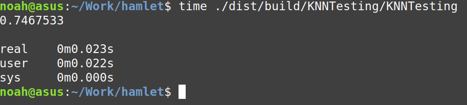
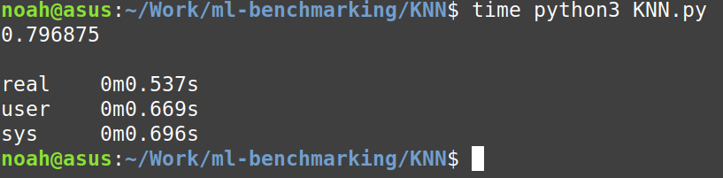

# Results (2022-11-29)

Accuracy of model on the diabetes dataset reached ~75% and ran in 22 milliseconds. The Python/scikit learn model ran in 1.365 seconds and had an accuracy of 79%. This difference in accuracy exists because of scikit learn randomly selects which entries go into training vs testing. As a result, the testing set has different entries entirely. Later in the future, I may make my test/train split also operate randomly, but Python and Haskell are going to use entirely different psuedo-random number generators anyhow, so it won't improve the situation.

